# Covachapp Deployment

## What is this document about?

This repository contains the proposal for the provisioning and deployment of web applications divided into microservices. There are 5 microservices running and 3 databases in a Kubernetes cluster. Also one in the CloudAMQP service.

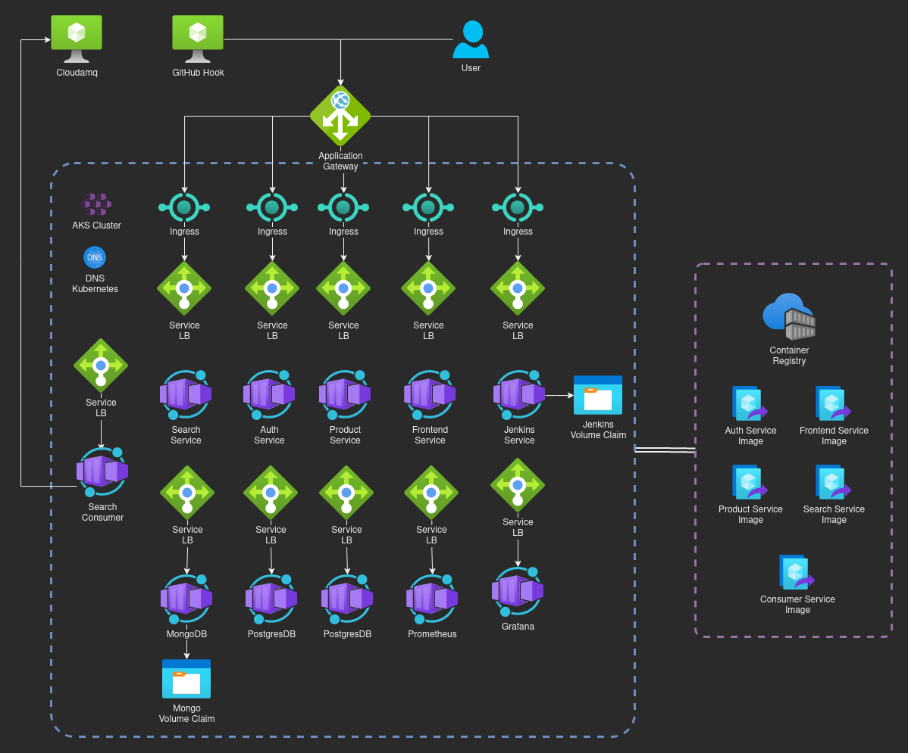

The ingress to the services is through an application gateway offered by Azure as an add-on to the AKS cluster, this service is the Azure counterpart to Nginx ingress. Then requests are proxied to the corresponding service by domain name or path. 

Outside the cluster, there is the Cloudamqp for queues service. And the Azure container registry that contains the docker images.

## What technologies are used?

### Provisioning

Terraform as provisioning tool for Azure Kubernetes cluster with the application gateway, the other resources are deployed with kubernetes. To automate many commands of Kubernetes we create some Bash scripts that runs Kubectl and Helm.

### Cloud Provider

We implement the infrastructure in Azure and use the Azure container registry for docker images. 

### Monitoring

For monitoring and alerting we proposed to use Prometheus and Grafana, there are the manifest files to launch these services and start configuring them.

### CI/CD

Finally, we create a Jenkins service to automate and run tests, this service is triggered by the repository hooks. The pipeline is configured by a Jenkinsfile stored in the repository.

## Execute

1. Go to the Terraform main file in provisioning/config and run:<br>
`tf init`<br>
`tf apply`<br>

2. Check if the cluster is created successfully

3. To configure the cluster, run the deploy bash script:<br>
`cd deployment`<br>
`./deployment.sh`<br>

4. I used an external DNS, so you need to update the DNS records to route the requests. I used inverse proxy by hostname and path, so it's mandatory to create the DNS records

5. Access the application

## Challenges

##### Ingress Implementation

The implementation of the Azure ingress was a little tricky because wasn't clear that all backend services need to implement health checks, so first I debugged different parts of the cluster, such as internal DNS, path, and networking. This happened because the proxy showed a 502 error without more explanation, so the community has posted a lot of possible causes.

##### Health checks

Then I face a challenge implementing the health checks in all backend services because some of them are written in languages or frameworks that I don't know. I made research to implement the checks.

##### Volumes claims and class

Finally, another challenge that I face was creating the volume in the Azure cloud, because the claim was okay but the volume wasn't created. So I figured out by reading the documentation that it's necessary to configure readwriteone in the claim because the disk storage needs it.

## Improvements

I found that a health check path is necessary to successfully route the requests made through the application gateway, so I created some endpoints in the services as a liveness probe and readiness probe.

Also, in future versions split the services into different repositories. This does not represent a big change in the CI/CD, because for each service you have to create the hook that triggers the job in Jenkins.

Finally, the last upgrade is to move the authoritative DNS to Azure and implement a logger tool.

## Folder Structure
```bash
|- assets (Readme resources)
|- data
|- deployment (Helm charts)
    |- go-app (Helmchart)
        |- charts
        |- templates
    |- jenkins (Files and values)
    |- launchs (Values for charts)
    |- mongo-db (Helmchart)
    |- monitoring (Repository of Grafana)
    |- next-app (Helmchart)
    |- postgres-db (Helmchart)
    |- python-app (Helmchart)
    |- secrects (envs)
    |- volumesAzure (Volume definition and claim)
    |- volumesConfigs (local)
|- docker
|- frontend
|- postman-collection
|- provisioning (Terraform Folder)
    |- config (Main, here tf init)
    |- logic (Module)
|-  services
    |- auth
    |- products
    |- search
```
## Screenshots

### Application
#### Access

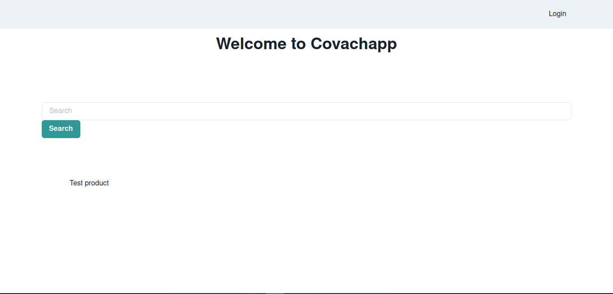

#### Login

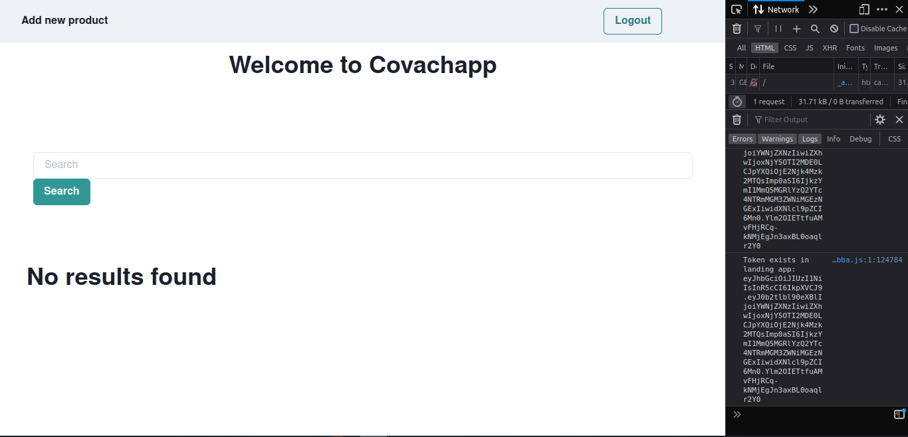

#### Product Creation

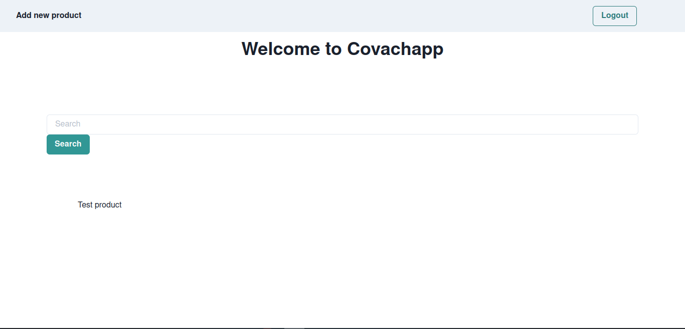

#### Search


### CI/CD
#### GitHub Hook

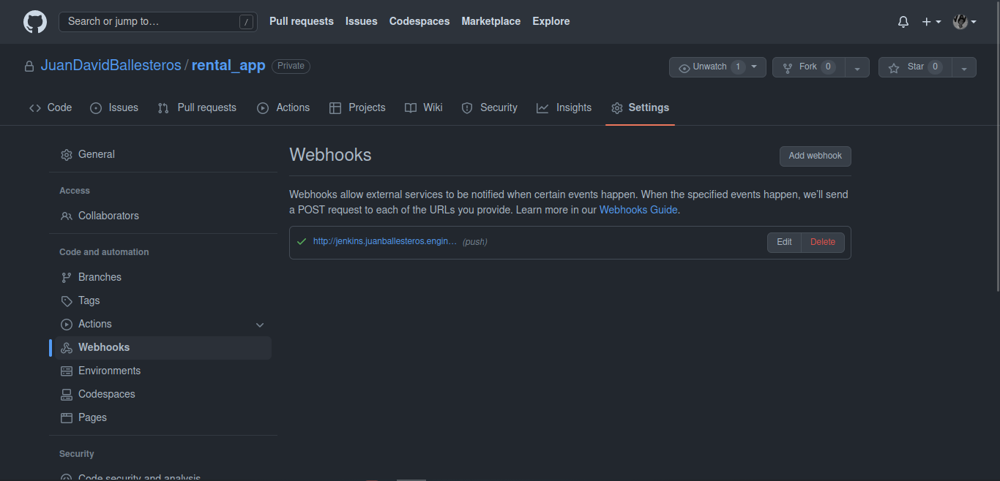

#### Jenkins Job

Job terminated successfully using Jenkinsfile
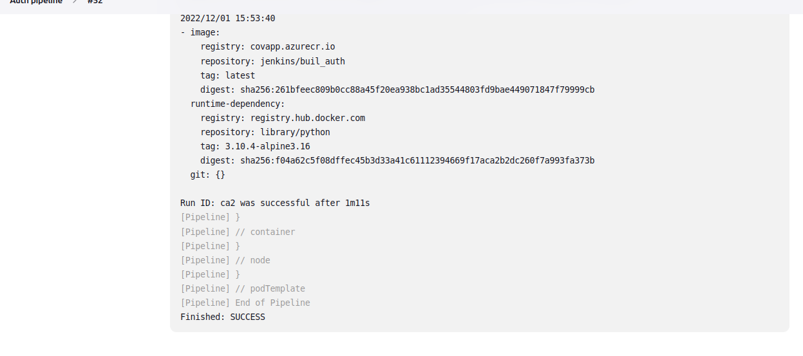
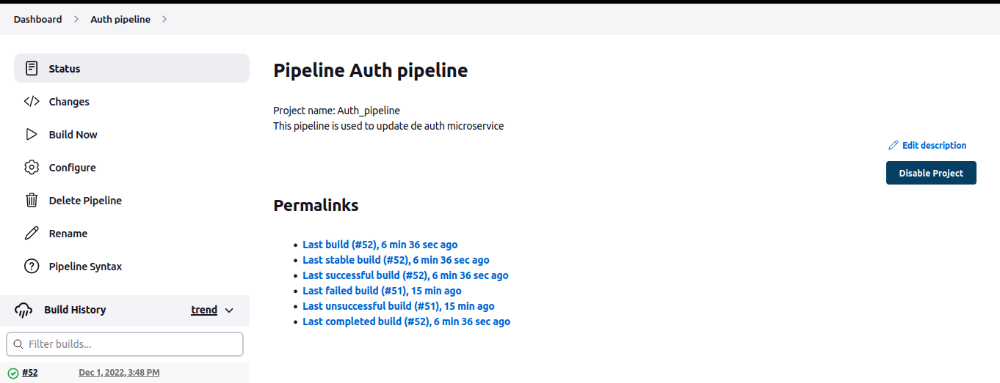

#### Azure ACR

Here you can see the image uploaded to the container repository
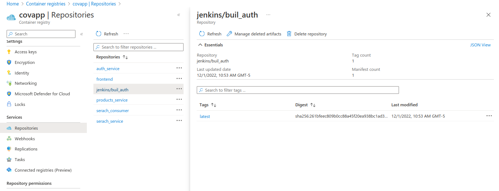

### Monitoring
#### Grafana 
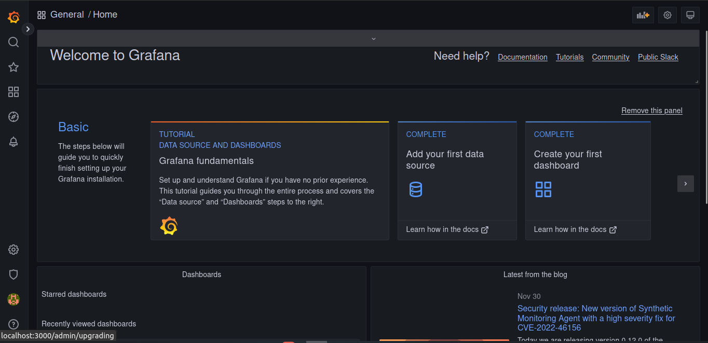

#### Dashboard compute resources
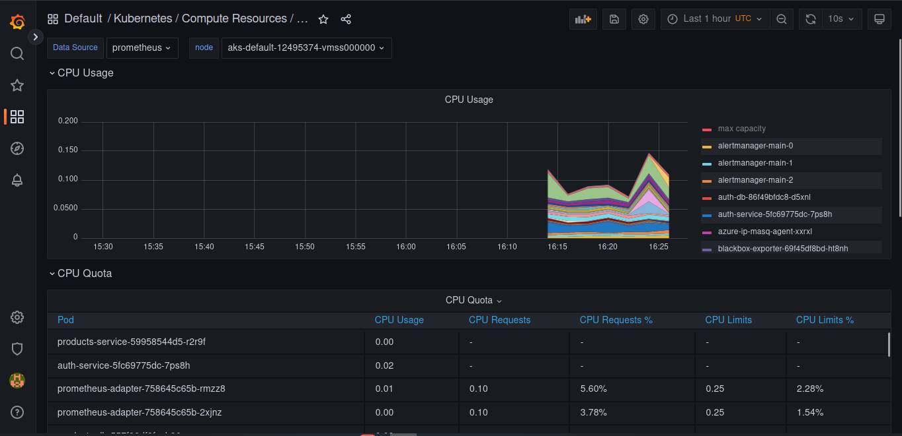
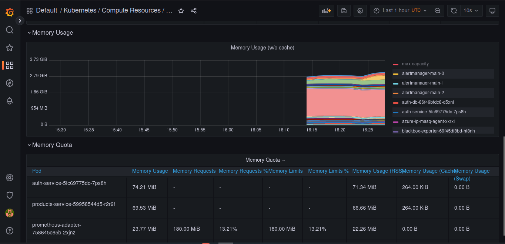
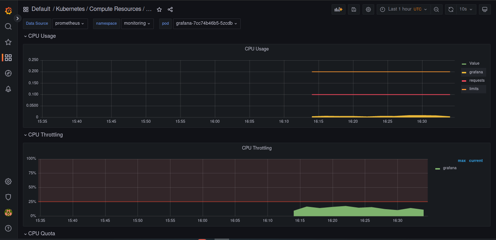

#### CPU Alerting 
Metric
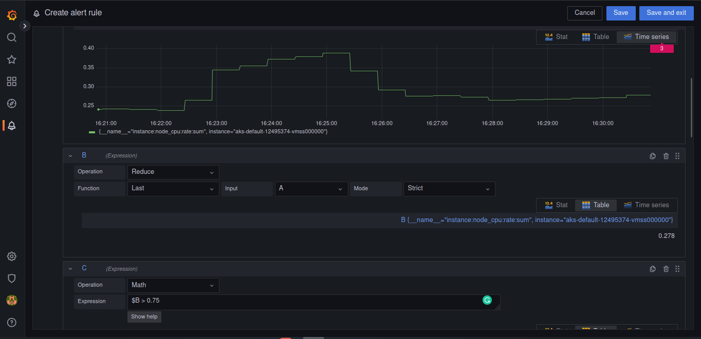

Alert
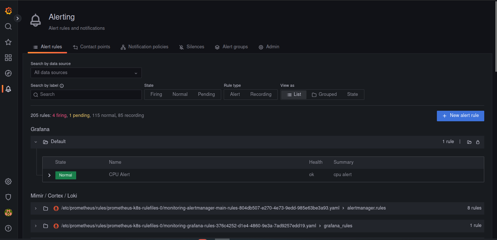

Notification
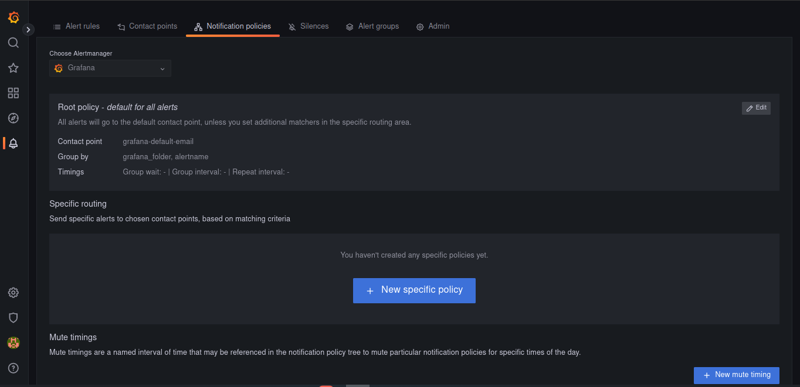
